<!-- Animated Banner -->

  

<!-- Soul Gem Divider -->

  

<!-- ABOUT SECTION -->
<!-- ✎ Edit the text below to describe yourself -->
<h3 align="center">✦ About Me</h3>

  <em>
    Unity & Unreal Engine developer
  </em>

  <a href="https://desuq.cafe">desuq.cafe</a>

  

<!-- TECH STACK BADGES -->
<h3 align="center">✦ Tech Stack</h3>

  <!-- Engines -->
  
  
  &nbsp;
  <!-- Languages -->
  
  
  
  
  &nbsp;
  <!-- Tech -->
  
  
  

  

<!-- CONTRIBUTION RIPPLE -->
<h3 align="center">✦ Contributions</h3>

  <picture>
    <source media="(prefers-color-scheme: dark)" srcset="https://raw.githubusercontent.com/desuqcafe/desuqcafe/output/contribution-ripple.svg"/>
    
  </picture>

  

<!-- FEATURED WORK -->
<h3 align="center">✦ Featured Work</h3>

<table align="center">
<tr>
<td width="50%" valign="top">

### Inhyeong
A growing ecosystem of personal projects — including a desktop anime companion aimed for Steam, a multiplayer RPG, and various tools. A long-running labor of love.

`Unity` `C#` `FishNet` `Windows API` `Python`

</td>
<td width="50%" valign="top">

### Component Navigator
A full inspector replacement for Unity that automatically categorizes, groups, and organizes your components — so you can stop scrolling and start building.

`Unity` `C#` `Editor Tools` `UI Toolkit`

</td>
</tr>
<tr>
<td width="50%" valign="top">

### [FishySteamworks](https://github.com/desuqcafe/InhyeongFishySteamworks) *(fork)*
Fork of FishySteamworks with memory leak fixes, corrected timeout logic, modern async cancellation, and quality of life improvements like configurable timeouts and Steam ID helpers.

`Unity` `C#` `FishNet` `Steamworks`

</td>
<td width="50%" valign="top">

### [Data Guardian](https://github.com/desuqcafe/blender-fake-user-manager-)
Blender add-on that protects your data from being silently deleted. Auto-applies fake user protection on save and creation, supporting 20+ data types with quick presets.

`Blender` `Python`

</td>
</tr>
</table>

  

<!-- FOOTER -->
<!-- ✎ Edit the footer text below -->

  
    契約は成立だ
  

<!-- Profile views counter (optional - uncomment to enable) -->
<!--

  

-->