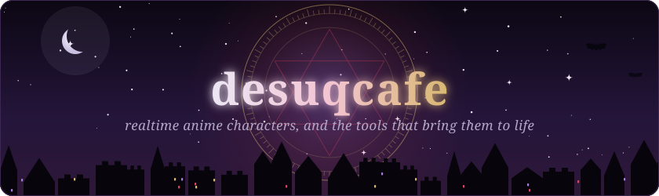
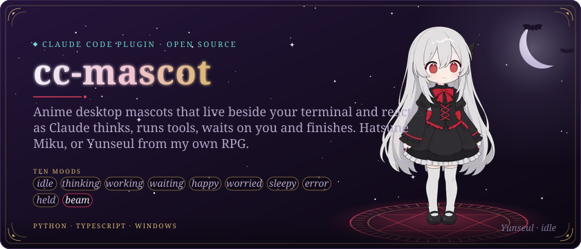
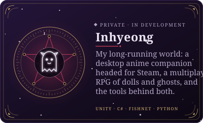
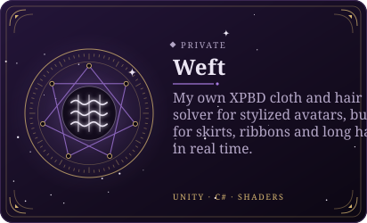
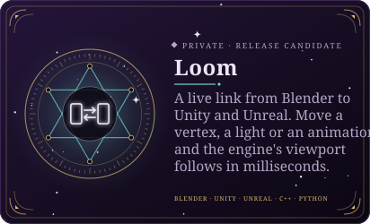
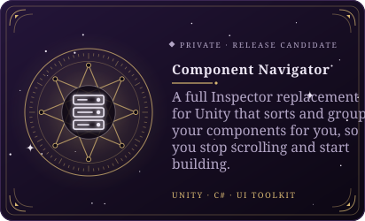
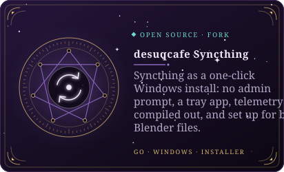
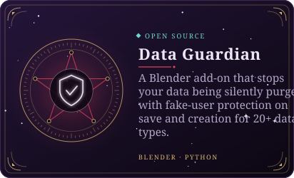
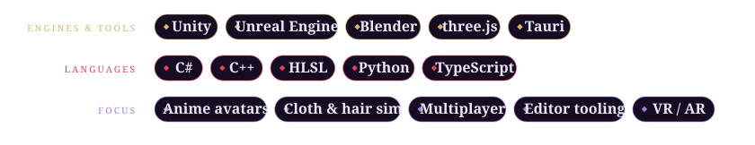

<!-- The SVGs in assets/ are generated by scripts/build-profile.py: edit the script, not the SVGs. -->

  

<!-- ABOUT -->

  

  <em>
    I build realtime anime characters in Unity, Unreal and Blender, along with the tools around them:
    desktop companions, a multiplayer RPG of dolls and ghosts, cloth and hair physics,
    and pipelines that move work between apps live.
  </em>

  <a href="https://desuq.cafe">desuq.cafe</a>

<!-- CONTRIBUTIONS (the ripple is rebuilt daily by .github/workflows/ripple.yml) -->

  

  

<!-- FEATURED WORK -->

  

  

  
  

  
  

  
  

<!-- TECH STACK -->

  

  

<!-- FOOTER -->

  契約は成立だ

